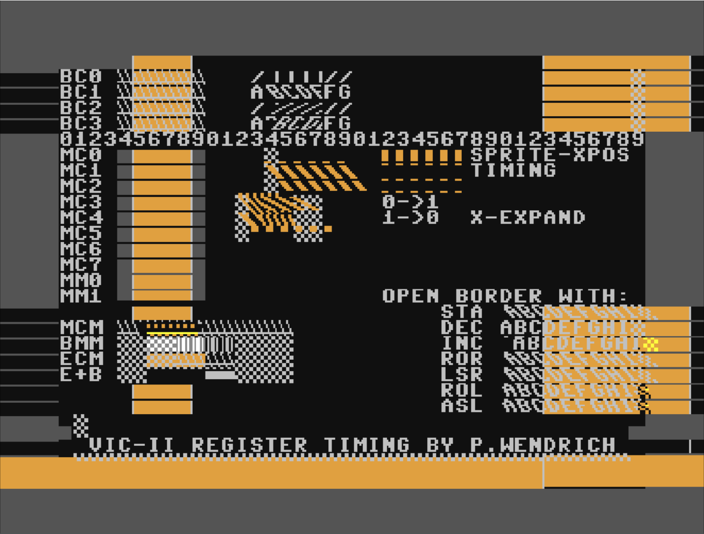

# VICII-PASSIVE
This repository contains a clock-cycle-accurate emulator of the VIC-II chip found in the Commodore-64 computer. The emulated VIC is "passive" in that it does not drive the memory bus but only **sniffs** the memory transactions and uses them the reproduce the video frame, hence the name "passive".

The emulator is written in ezhdl, a python module I am developing to be able to simulate HDL (FPGA-like) designs in python. This allows to create a design that is directly portable to an FPGA.

# Main Simulation

## Prerequisites

- Python 3.6 or higher installed and added to the `Path` environment variable
- GTKWAVE installed and added to the `Path` environment variable
- `git submodule update --init --recursive`
- `pip install ezpath`
- `pip install ezhdl`
- `pip install pyvcd`
- `pip install openpyxl`
- `pip install curses`

## Principle of Operation

An entire frame of memory transactions between the VIC-II and the CPU was dumped from a real Commodore-64 while running the famous **"VIC-II REGISTER TIMING BY P. WENDRICH"** test program, which produces the following static video output.

<figure align="center" id="blue_64_reg">
	
	<figcaption>Target Output</figcaption>
</figure>

The main simulation feeds these transactions, one per clock-cycle, to the VIC-II emulator, which in turn reproduces the underlying video frame and plots it line-by-line in real time.

At the end of the simulation a `waves.vcd` file will be available in the `development/test/output` folder, which can be visualized with GTKWAVE

As an additional output, the file `development/test/output/frame_analysis.xlsx` is generated. This is a **large** Excel sheet where each cell represents a pixel. Double-clicking on a cell (pixel) will expand it, showing all events that were registered by the emulator at that specific clock cycle

## Running the Simulation

Once the prerequisites mentioned above have been satisfied, simply run the script `python3 development/test/tc_vic_passive.py`. The real-time frame plot will appear shortly and the simulation will terminate after the whole frame has been generated twice.
